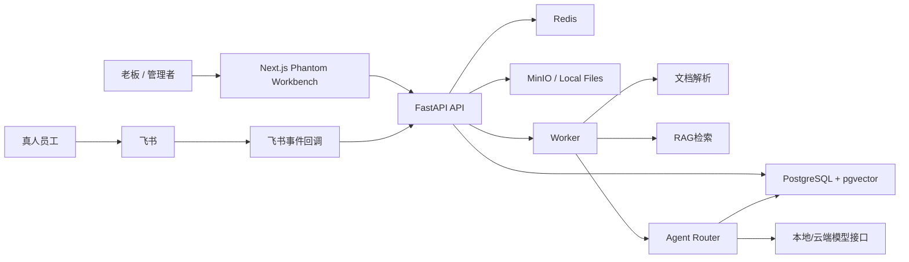

# Phantom AI Workstation 7天MVP技术计划

版本：V0.1  
对应规格：[01-spec-7day-mvp.md](/Users/yanlyubo/Desktop/未命名文件夹/docs/phantom-ai-workstation/01-spec-7day-mvp.md)  
目标：用最小企业级基座支撑一条真实可演示的数字员工协同闭环

## 1. 技术原则

```text
先闭环，后平台
先结构化任务，后复杂Agent自治
先轻量企业基座，后SSO/Keycloak
先pgvector，后Qdrant
先飞书一个连接器，后多平台连接器
先3个真执行Agent，后6个全能力Agent
```

## 2. 推荐技术栈

### 2.1 前端

```text
Next.js
React
TypeScript
Tailwind CSS
shadcn/ui
TanStack Query
SSE
Zod
```

用途：

| 技术 | 用途 |
| --- | --- |
| Next.js | 工作台路由、前端工程骨架 |
| React | 复杂交互界面 |
| TypeScript | 类型约束 |
| Tailwind CSS | 快速构建设计系统 |
| shadcn/ui | 企业级工作台组件 |
| TanStack Query | API请求、缓存、任务状态刷新 |
| SSE | Agent执行过程和任务状态实时推送 |
| Zod | 前端表单和Command Protocol校验 |

### 2.2 后端

```text
FastAPI
Python
SQLAlchemy
Alembic
Pydantic
PostgreSQL + pgvector
Redis
Celery 或 RQ
MinIO 或本地文件系统
```

用途：

| 技术 | 用途 |
| --- | --- |
| FastAPI | REST API、SSE、OpenAPI |
| SQLAlchemy | ORM |
| Alembic | 数据库迁移 |
| PostgreSQL | 主业务数据库 |
| pgvector | MVP向量检索 |
| Redis | 队列、缓存、事件缓冲 |
| Celery/RQ | 文档解析、Embedding、Agent执行异步任务 |
| MinIO/本地文件 | 文档和生成物存储 |

### 2.3 AI层

```text
Command Protocol Parser
Agent Router
Prompt Templates
RAG Search Tool
Artifact Writer
Model Gateway
```

7天内不引入复杂多Agent框架。Agent执行采用轻量编排：

```text
任务卡
-> Agent Router
-> 选择主责Agent
-> 加载Prompt和工具权限
-> 调用知识库检索
-> 生成结构化结果
-> 写入task_events和artifacts
```

## 3. 系统架构



## 4. Monorepo结构

```text
phantom-ai-workstation/
├── apps/
│   ├── web/
│   ├── api/
│   └── worker/
├── packages/
│   ├── contracts/
│   ├── prompt-kits/
│   └── config/
├── infra/
│   ├── compose/
│   └── scripts/
├── docs/
│   ├── product/
│   ├── api/
│   └── runbook/
├── tests/
│   ├── e2e/
│   └── fixtures/
├── docker-compose.yml
├── Makefile
└── README.md
```

## 5. 企业级基座

7天MVP不做重型IAM，但必须把企业级边界埋好。

### 5.1 账号与工作区

```text
workspaces
users
workspace_members
roles
permissions
sessions
audit_logs
```

原则：

```text
所有业务表必须带workspace_id
所有用户操作必须写audit_logs
所有API必须通过当前workspace上下文过滤数据
```

### 5.2 轻量RBAC

默认角色：

| 角色 | 权限 |
| --- | --- |
| owner | 全部权限 |
| admin | 用户、配置、知识库、任务管理 |
| manager | 创建任务、确认任务、查看团队任务 |
| member | 查看和处理自己的协同请求 |
| viewer | 只读 |

权限粒度：

```text
workspace:read
workspace:update
users:read
users:write
roles:read
roles:write
agents:read
agents:run
tasks:read
tasks:write
tasks:approve
documents:read
documents:write
integrations:read
integrations:write
audit:read
settings:update
```

## 6. 数据模型

### 6.1 基座表

```sql
workspaces (
  id uuid primary key,
  name text not null,
  slug text unique,
  status text default 'active',
  settings jsonb default '{}',
  created_at timestamptz,
  updated_at timestamptz
);

users (
  id uuid primary key,
  email text unique not null,
  name text not null,
  password_hash text not null,
  avatar_url text,
  status text default 'active',
  created_at timestamptz,
  updated_at timestamptz
);

workspace_members (
  id uuid primary key,
  workspace_id uuid references workspaces(id),
  user_id uuid references users(id),
  role_id uuid references roles(id),
  display_name text,
  feishu_user_id text,
  status text default 'active',
  created_at timestamptz,
  updated_at timestamptz
);

roles (
  id uuid primary key,
  workspace_id uuid references workspaces(id),
  name text not null,
  key text not null,
  permissions jsonb default '[]',
  created_at timestamptz,
  updated_at timestamptz
);
```

### 6.2 Agent与任务

```sql
agents (
  id uuid primary key,
  workspace_id uuid references workspaces(id),
  key text not null,
  name text not null,
  execution_mode text not null, -- real / semi_auto
  description text,
  tools jsonb default '[]',
  permissions jsonb default '[]',
  status text default 'active',
  created_at timestamptz,
  updated_at timestamptz
);

agent_prompts (
  id uuid primary key,
  workspace_id uuid references workspaces(id),
  agent_id uuid references agents(id),
  version int default 1,
  role_prompt text not null,
  output_schema jsonb default '{}',
  guardrails jsonb default '{}',
  is_active boolean default true,
  created_at timestamptz
);

tasks (
  id uuid primary key,
  workspace_id uuid references workspaces(id),
  creator_id uuid references users(id),
  title text not null,
  goal text,
  type text not null,
  status text default 'draft',
  command_protocol jsonb not null,
  primary_agent_id uuid references agents(id),
  approval_required boolean default true,
  due_at timestamptz,
  archived_at timestamptz,
  created_at timestamptz,
  updated_at timestamptz
);

task_runs (
  id uuid primary key,
  workspace_id uuid references workspaces(id),
  task_id uuid references tasks(id),
  agent_id uuid references agents(id),
  status text default 'queued',
  model_name text,
  input jsonb default '{}',
  output jsonb default '{}',
  error text,
  started_at timestamptz,
  finished_at timestamptz,
  created_at timestamptz
);

task_events (
  id uuid primary key,
  workspace_id uuid references workspaces(id),
  task_id uuid references tasks(id),
  run_id uuid references task_runs(id),
  event_type text not null,
  actor_type text,
  actor_id uuid,
  message text,
  metadata jsonb default '{}',
  created_at timestamptz
);
```

### 6.3 知识库与向量

```sql
documents (
  id uuid primary key,
  workspace_id uuid references workspaces(id),
  uploader_id uuid references users(id),
  name text not null,
  file_type text,
  object_key text,
  parse_status text default 'uploaded',
  metadata jsonb default '{}',
  created_at timestamptz,
  updated_at timestamptz
);

document_chunks (
  id uuid primary key,
  workspace_id uuid references workspaces(id),
  document_id uuid references documents(id),
  chunk_index int not null,
  content text not null,
  page_start int,
  page_end int,
  metadata jsonb default '{}',
  embedding vector(1536),
  created_at timestamptz
);
```

注意：`embedding vector(1536)` 的维度要和实际Embedding模型保持一致。若使用本地Embedding模型，建库时按最终维度调整。

### 6.4 飞书与审计

```sql
feishu_integrations (
  id uuid primary key,
  workspace_id uuid references workspaces(id),
  app_id text,
  encrypted_app_secret text,
  encrypt_key text,
  verification_token text,
  bot_open_id text,
  status text default 'active',
  settings jsonb default '{}',
  created_at timestamptz,
  updated_at timestamptz
);

audit_logs (
  id uuid primary key,
  workspace_id uuid references workspaces(id),
  actor_type text not null,
  actor_id uuid,
  action text not null,
  resource_type text,
  resource_id uuid,
  metadata jsonb default '{}',
  created_at timestamptz
);
```

## 7. API设计

### 7.1 Auth

```text
POST /api/v1/auth/login
POST /api/v1/auth/logout
GET  /api/v1/me
GET  /api/v1/workspaces/current
```

### 7.2 Agents

```text
GET  /api/v1/agents
GET  /api/v1/agents/{agent_id}
POST /api/v1/agents/{agent_id}/run
```

### 7.3 Command Protocol

```text
POST /api/v1/commands/parse
```

请求：

```json
{
  "input": "帮我准备明天下午给华星科技的合作方案，让销售小张补充预算，销售助理生成话术，内容助理生成PPT大纲。"
}
```

响应：

```json
{
  "command_protocol": {
    "task_title": "华星科技合作方案准备",
    "task_goal": "准备合作方案、沟通话术和PPT大纲",
    "task_type": "客户跟进",
    "primary_agent": "销售助理",
    "collaborating_agents": ["知识库助理", "内容助理", "老板助理"],
    "human_collaborators": ["销售小张"],
    "input_sources": ["客户资料", "产品资料", "历史方案"],
    "expected_outputs": ["客户分析", "沟通话术", "PPT大纲", "邮件草稿"],
    "deadline": "明天下午",
    "approval_required": true,
    "risk_level": "medium",
    "notification_channel": "飞书",
    "archive_location": "任务中心"
  }
}
```

### 7.4 Tasks

```text
POST /api/v1/tasks
GET  /api/v1/tasks
GET  /api/v1/tasks/{task_id}
POST /api/v1/tasks/{task_id}/confirm
POST /api/v1/tasks/{task_id}/start
POST /api/v1/tasks/{task_id}/approve
POST /api/v1/tasks/{task_id}/archive
GET  /api/v1/tasks/{task_id}/timeline
GET  /api/v1/events/tasks/{task_id}
```

任务状态：

```text
draft
pending_confirm
running
waiting_human
waiting_approval
completed
archived
failed
canceled
```

### 7.5 Knowledge

```text
POST /api/v1/documents
POST /api/v1/documents/{document_id}/ingest
GET  /api/v1/documents
GET  /api/v1/documents/{document_id}
POST /api/v1/knowledge/search
```

### 7.6 飞书

```text
POST /api/v1/integrations/feishu/events
POST /api/v1/integrations/feishu/send-message
GET  /api/v1/integrations/feishu/status
```

## 8. 飞书集成方案

7天MVP采用飞书自建应用机器人，而不是只做自定义机器人。

原因：

```text
自定义机器人适合单向推送
自建应用机器人可以接收消息事件
MVP需要“小张回复预算 -> 回流任务中心”
```

最小链路：

```text
Phantom生成补充请求
-> 调用飞书发送消息给小张
-> 小张回复机器人
-> 飞书事件回调到 /integrations/feishu/events
-> 验证事件来源
-> 解析消息文本
-> 匹配task_id
-> 写入task_events
-> 任务状态从waiting_human变为running
-> 销售助理继续执行
```

消息中必须携带任务识别信息：

```text
[Phantom任务: TSK-20260705-001]
销售助理需要你补充华星科技客户预算。
请直接回复预算金额、采购周期、关键联系人。
```

## 9. Agent执行设计

### 9.1 3个真执行Agent

| Agent | 工具 | 输出 |
| --- | --- | --- |
| 销售助理 | knowledge.search、feishu.request_human、artifact.write | 客户分析、话术、邮件草稿 |
| 知识库助理 | document.search、document.summarize、citation.write | 资料摘要、证据引用 |
| 老板助理 | task.summarize、risk.check、approval.prepare | 一页确认版、风险提醒 |

### 9.2 3个半自动Agent

| Agent | MVP行为 |
| --- | --- |
| 运营助理 | 根据任务卡生成执行步骤和状态提示 |
| 内容助理 | 根据模板生成PPT大纲和文案 |
| 代码助理 | 根据模板生成小工具需求说明 |

## 10. 版本演进

| 版本 | 时间 | 目标 |
| --- | --- | --- |
| V0.1 | Day 1-2 | 前端原型、企业基座、菜单、默认Agent |
| V0.2 | Day 3 | Command Protocol解析与任务卡 |
| V0.3 | Day 4 | Demo数据、知识库上传与检索 |
| V0.4 | Day 5-6 | 3个真执行Agent与任务运行 |
| V0.5 | Day 7 | 飞书通知与回复回流 |
| V0.6 | 30天样机 | 更完整RAG、文档Artifact、更多场景 |
| V1.0 | 试点交付 | Keycloak/SSO、多连接器、Qdrant、部署SOP |

## 11. 安全与审计

MVP必须记录：

```text
用户登录
自然语言解析
任务创建
任务确认
Agent执行
知识库检索
飞书消息发送
飞书回复回流
结果生成
老板确认
任务归档
```

敏感信息处理：

```text
飞书App Secret加密存储
模型API Key加密存储
所有外部调用写审计日志
任务结果必须经过老板确认后才可外发
```

## 12. 开发方法

采用 Spec Kit 风格：

```text
spec -> plan -> tasks -> implement -> verify
```

采用 Superpowers 风格的执行纪律：

```text
先澄清
再计划
任务小步提交
关键路径先写测试
每个任务完成后做自查
演示链路每天跑一遍
```

7天内不追求抽象完美，追求：

```text
业务闭环真实
数据模型不返工
演示链路稳定
后续扩展路径清楚
```

